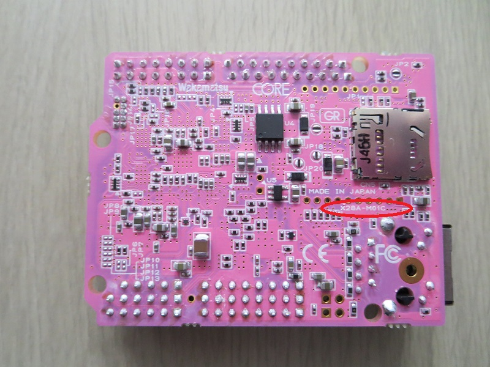
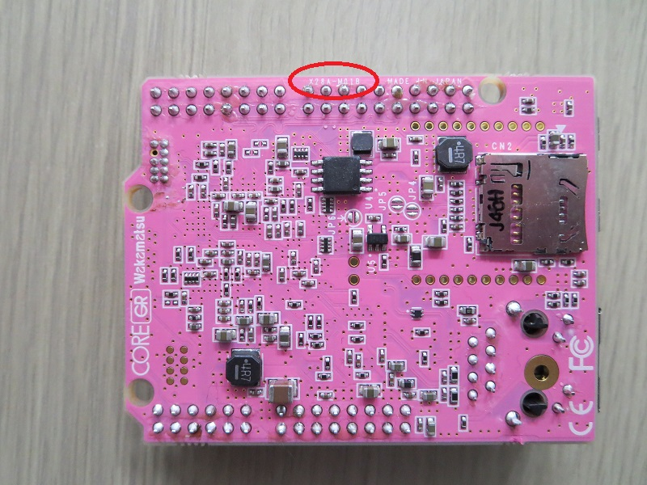

## Gr Peach board (datasheet, reference manual, schematic...)
- Software:
    + To be able to build the example by mbed compiler online
        * [Getting start](https://developer.mbed.org/teams/Renesas/wiki/GR-PEACH-Getting-Started)
- Hardware:
    + Schematic
        * [revision E (X28A-M01E)](https://developer.mbed.org/media/uploads/1050186/x28a-m01-ef.pdf), [revision C (X28A-M01C)](https://developer.mbed.org/media/uploads/1050186/x28a-m01-cd.pdf). 
        * [revision B(X28A-M01B)](http://www.core.co.jp/product/m2m/gr-peach/pdf/history/gr-peach_circuit_b.pdf). 
    + Jumper setting: [link](https://developer.mbed.org/teams/Renesas/wiki/Jumper-settings-of-GR-PEACH)

## RZ/AH1 MCU [link](https://www.renesas.com/en-sg/products/microcontrollers-microprocessors/rz/rza/rza1h.html)
- Software:
    + Development tool:
        * [e2 studio](https://www.renesas.com/en-us/products/software-tools/tools/ide/e2studio.html)
        * [mbed compiler](https://developer.mbed.org/handbook/mbed-Tools)
        * [mbed compiler offline](http://hamblen.ece.gatech.edu/2036/Using%20the%20offline%20compiler%20with%20mbed%20at%20Georgia%20Tech.htm)       
- Hardware
    + manual: [link](https://www.renesas.com/en-sg/doc/products/mpumcu/doc/rz/r01uh0403ej0300_rz_a1h.pdf?key=c9238be3bc64539027cf8b0d5eb5b0d8)

## Audio camera shield
- [link](https://developer.mbed.org/teams/Renesas/wiki/Audio_Camera-shield)

## LCD Shield
- [link](https://developer.mbed.org/teams/Renesas/wiki/LCD-shield)

## BP3595 WiFi module
- [link](https://developer.mbed.org/components/BP3595-for-GR-PEACH/)